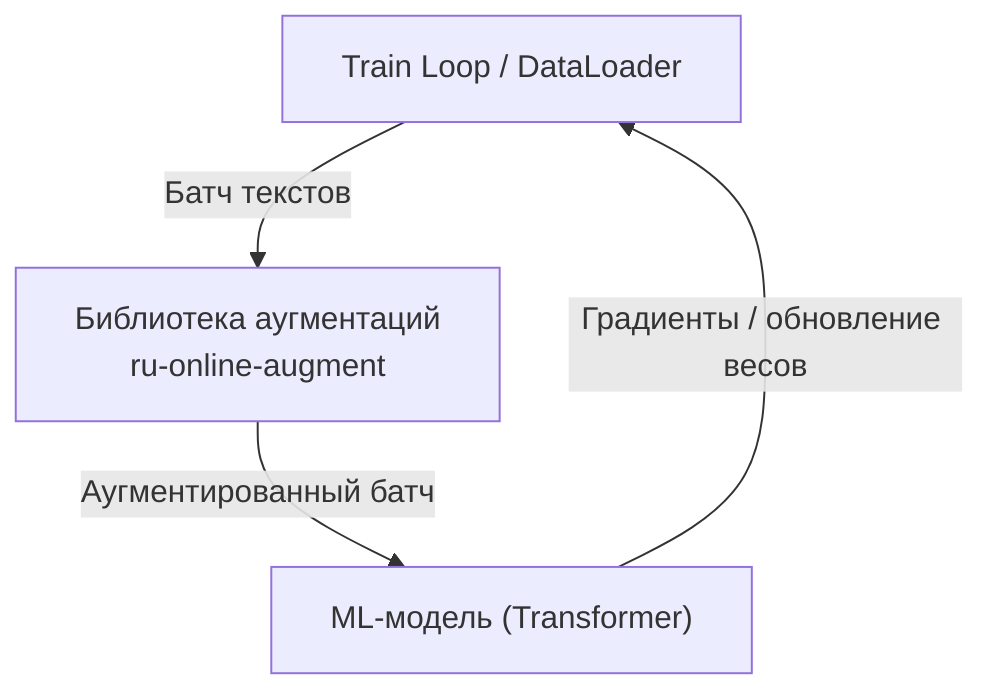
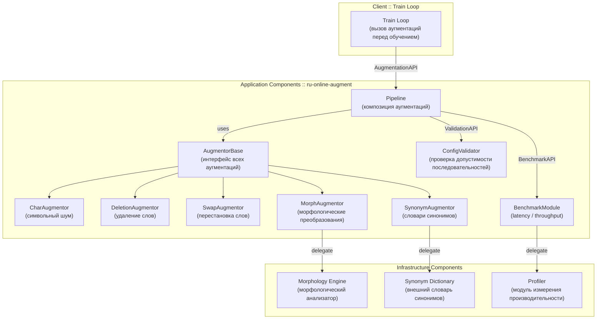
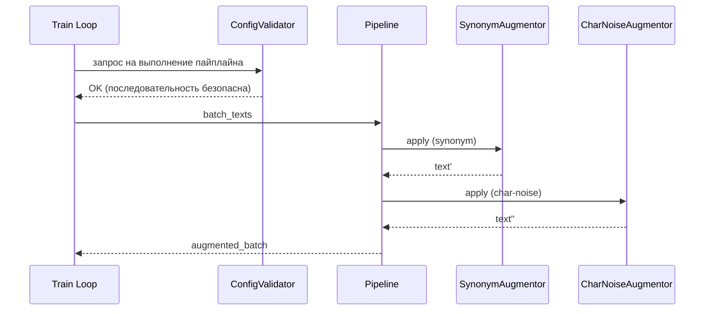

# **ML System Design Document.**

## **1. Введение.**
### **1.1. Контекст.**

В индустриальных онлайн‑сервисах, работающих с русскоязычными текстами (чат‑боты, классификация обращений, маршрутизация запросов), требуется быстро и надёжно обрабатывать текст с разнообразными формулировками.
Аугментации обычно используются для расширения обучающих данных, но существующие библиотеки ориентированы на оффлайн‑режим и не обеспечивают стабильную работу при требованиях к низкой задержке (*low‑latency*).

### **1.2. Цель проекта.**

Разработать оптимизированную Python‑библиотеку для онлайн‑аугментаций русскоязычных текстов с низкими задержками (*p95/p99*), минимальными зависимостями и предсказуемым поведением.

### **1.3. Основная идея.**

Создать модульную систему аугментаций, ориентированную на:
   - скорость,
   - стабильность,
   - простоту интеграции,
   - поддержку русского языка,
   - возможность сравнения с существующими решениями.

Библиотека предоставит набор простых, предсказуемых и быстрых аугментаций, которые можно использовать в онлайн‑сервисах, ML‑пайплайнах, при генерации обучающих данных, в тестировании устойчивости моделей.

---

### **1.4. Связанные исследования и эмпирические основания.**

Современные исследования показывают, что текстовые аугментации существенно повышают качество моделей, особенно в условиях ограниченных данных. Ниже приведены результаты работ, на которые опирается данный проект.

#### Табличная визуализация (ASCII bar chart) 1. 

#### Влияние простых текстовых аугментаций (EDA) на качество моделей и точность классификации (Wei & Zou, 2019 — EDA: Easy Data Augmentation).

| Train size | Baseline | +EDA | Δ |
|-----------|----------|------|----|
| 500 | 76.9% ▓▓▓▓▓▓▓▓ | 79.9% ▓▓▓▓▓▓▓▓▓ | +3.0 |
| 2000 | 84.6% ▓▓▓▓▓▓▓▓▓▓ | 85.4% ▓▓▓▓▓▓▓▓▓▓ | +0.8 |
| 5000 | 86.9% ▓▓▓▓▓▓▓▓▓▓▓ | 87.8% ▓▓▓▓▓▓▓▓▓▓▓ | +0.9 |
| full | 87.8% ▓▓▓▓▓▓▓▓▓▓▓ | 88.6% ▓▓▓▓▓▓▓▓▓▓▓ | +0.8 |

*Примечание.* Простые текстовые аугментации (EDA), включающие замену слов синонимами, случайные вставки, перестановки и удаления, повышают точность моделей на всех размерах обучающего набора. 
На малых датасетах (500 примеров) прирост достигает **+3%**, что подтверждает эффективность аугментаций в условиях ограниченных данных. 
На средних и больших выборках улучшение остаётся стабильным (**+0.8–0.9%**), что указывает на повышение устойчивости и обобщающей способности моделей.

#### Табличная визуализация (ASCII bar chart) 2.

#### **Latency (ms) разных библиотек текстовых аугментаций**

| Библиотека / Метод        | Latency (ms) | Гистограмма |
|---------------------------|--------------|-------------|
| nlpaug — CharAug          | 5–15         | ▓▓▓▓        |
| nlpaug — SynonymAug       | 20–40        | ▓▓▓▓▓▓▓     |
| TextAttack — WordSwap     | 15–30        | ▓▓▓▓▓       |
| TextAttack — Embedding    | 40–80        | ▓▓▓▓▓▓▓▓▓   |
| nlpaug — BERT Contextual  | 150–300      | ▓▓▓▓▓▓▓▓▓▓▓▓▓▓▓▓ |
| TextAttack — BERT-based   | 200–400      | ▓▓▓▓▓▓▓▓▓▓▓▓▓▓▓▓▓▓▓ |
| RuAug — MorphAug (оценка) | 20–40        | ▓▓▓▓▓▓▓     |
| RuAug — SynonymAug (оценка)| 10–20       | ▓▓▓▓        |

*Примечание.* Показанные выше значения являются ориентировочными, собранными из открытых источников (GitHub Issues, обсуждения пользователей, инженерные оценки).
В научных публикациях отсутствуют официальные бенчмарки latency для nlpaug, TextAttack и RuAug, поскольку эти библиотеки создавались как исследовательские фреймворки, а не как production‑инструменты.

В рамках проекта планируется провести собственный бенчмарк на единых условиях (одинаковый CPU, одинаковые тексты, одинаковые параметры), чтобы получить корректное сравнение с разрабатываемой библиотекой.

---

## **2. Постановка задачи.**
### **2.1. Проблема.**

Существующие библиотеки (nlpaug, TextAttack, RuAug):
   - не оптимизированы под сценарии с низкой задержкой,
   - используют тяжёлые зависимости (transformers, torch),
   - не учитывают особенности русского языка,
   - не обеспечивают стабильного времени отклика,
   - не подходят для интеграции в продакшен‑сервисы.

### **2.2. Требования к системе.**

 - **Функциональные:**
  
  - **Поддержка базовых аугментаций**: библиотека должна предоставлять набор лёгких и быстрых аугментаций, включающий:
     - символьный шум (char‑noise),
     - случайное удаление слов (random deletion),
     - случайная перестановка слов (random swap),
     - замена слова на один из заранее определённых синонимов из словаря (словарная синонимизация),
     - изменение формы слова (падеж, число и т.п.) с использованием морфологического анализатора (морфологические преобразования (опционально, так как они могут иметь более высокую задержку).

 - **Композиция аугментаций в пайплайны**: система должна позволять объединять несколько аугментаторов в последовательный пайплайн с единым вызовом.
 - **Единый интерфейс для всех аугментаций**: все аугментаторы должны реализовывать общий интерфейс (__call__(text: str) -> str), обеспечивая предсказуемость и удобство использования.

 - **Нефункциональные:**

   - **Низкая задержка выполнения**:

     *Время обработки коротких текстов (до 20 токенов) должно обеспечивать latency p95 ≤ 5–10 ms, что позволяет использовать библиотеку в онлайн‑сценариях.*
     
   - **Минимальные зависимости**:
     
     *Библиотека должна работать на стандартной библиотеке Python (stdlib) и использовать дополнительные зависимости (например, pymorphy2) только при необходимости.*
     
   - **Предсказуемое поведение** (никаких тяжёлых моделей по умолчанию):
     
     *Аугментации должны быть детерминированными в рамках заданных параметров и не использовать тяжёлые модели, влияющие на задержку или стабильность.*
     
   - **Возможность профилирования и бенчмаркинга**:
     
     *Система должна предоставлять инструменты и сценарии для измерения производительности (latency p50/p95/p99), что позволит контролировать качество и оптимизировать узкие места.*
     
   - **Интеграция с обучающими пайплайнами (train‑loop)**:
     
     *Библиотека ориентирована не на микросервисы, а на train loops и стандартные ML‑пайплайны (PyTorch, HuggingFace Datasets, Lightning, Accelerate).
Она должна легко встраиваться в процесс обучения моделей, обеспечивая быстрые трансформации прямо перед подачей батча.*

---

## **3. Обзор существующих решений.**

### **Сравнение существующих библиотек текстовых аугментаций:**

| Критерий | nlpaug | TextAttack | RuAug | Разрабатываемая библиотека |
| --- | --- | --- | --- | --- |
| Поддержка русского языка | частичная | слабая | хорошая | **полная** |
| Задержка (latency) | средняя/высокая | высокая | средняя | **низкая (p95 ≤ 5–10 ms)** |
| Зависимости | тяжёлые (transformers, torch) | очень тяжёлые | лёгкие | **минимальные (stdlib + опционально pymorphy2)** |
| Предсказуемость | средняя | низкая | средняя | **высокая (детерминированность)** |
| Поддержка онлайн‑аугментаций | нет | нет | частично | **да** |
| Поддержка пайплайнов | ограниченная | сложная | нет | **простая и модульная** |
| Морфология | нет | нет | есть | **опционально, оптимизировано** |
| Целевой сценарий | ресёрч | атаки на модели | ресёрч | **онлайн‑обучение и low‑latency** |

### **Преимущества и недостатки существующих библиотек текстовых аугментаций:**

| Инструмент | Преимущества | Недостатки |
|-----------|--------------|------------|
| **nlpaug** | • Большой набор аугментаций<br>• Поддержка моделей (BERT, word2vec)<br>• Хорошая документация | • Высокая задержка<br>• Тяжёлые зависимости (transformers, torch)<br>• Англоцентричность<br>• Нестабильное время отклика |
| **TextAttack** | • Самый мощный фреймворк для NLP‑трансформаций<br>• Богатая экосистема атак и аугментаций<br>• Гибкая архитектура | • Очень тяжёлая архитектура<br>• Огромный overhead<br>• Не предназначен для продакшена<br>• Высокая latency |
| **RuAug** | • Русскоязычный фокус<br>• Лёгкие зависимости<br>• Простая установка | • Ограниченный набор аугментаций<br>• Нет оптимизации под latency<br>• Нет пайплайнов и валидации последовательностей |
| **Разрабатываемая библиотека** | • Low‑latency дизайн<br>• Минимальные зависимости<br>• Полная поддержка русского языка<br>• Детерминированность и предсказуемость<br>• Онлайн‑аугментация в train‑loop<br>• Модульные пайплайны с валидацией | • Ограниченный набор аугментаций в MVP<br>• Морфология может быть медленной (решается кэшированием и отложенной загрузкой) |

*Примечание.* Анализ существующих решений показывает, что ни одна библиотека не удовлетворяет требованиям low‑latency, минимальных зависимостей и русскоязычной оптимизации. Разрабатываемая библиотека закрывает эти пробелы и ориентирована на онлайн‑аугментацию в обучающих пайплайнах.

---

## **4. Методы и подходы.**

### **4.1. Типы аугментаций, включённые в MVP.**

| Тип | Пример | Сложность | Latency |
| --- | --- | --- | --- |
| Char‑noise | «карта» → «крата» | низкая | очень низкая |
| Random deletion | удаление слова | низкая | низкая |
| Random swap | перестановка слов | низкая | низкая |
| Синонимизация (словарь) | «кредит» → «займ» | средняя | низкая |
| Морфология (опционально) | «кредит» → «кредита» | средняя | средняя |

### **4.2. Почему именно эти методы?**

- они быстрые,
- они не требуют моделей,
- они легко контролируются,
- они хорошо подходят для русского языка.

---
  
## **5. Архитектура системы.**

### ** 5.1. System Context Diagram.**



*Примечание.* Диаграмма отражает поток данных внутри обучающего контура и показывает, что библиотека используется исключительно в train‑loop.

**Акторы:**
 - Train Loop / DataLoader,
 - Модель (Transformer),
 - Библиотека аугментаций.

**Потоки:**
 - DataLoader подаёт батч текстов.
 - Библиотека применяет быстрые аугментации онлайн.
 - Аугментированный батч передаётся в модель.
 - Модель обучается на аугментированных данных.
    
### **5.2. Component Diagram.**



*Примечание.* Диаграмма компонентов библиотеки ru‑online‑augment отражает архитектуру взаимодействия между внутренними модулями, клиентом (train‑loop) и внешними инфраструктурными зависимостями.

**Компоненты:**
 - AugmentorBase - интерфейс всех аугментаций,
 - CharAugmentor - аугментация символьным шумом (char‑noise),
 - DeletionAugmentor - аугментация случайным удалением слов (random deletion),
 - SwapAugmentor - аугментация случайной перестановкой слов (random swap),
 - SynonymAugmentor - словарная синонимизация (synonym replacement),
 - MorphAugmentor - морфологические преобразования (morphological transformations),
 - Pipeline - композиция аугментаций с последовательным применением,
 - Config Validator - проверка допустимости и безопасности последовательностей аугментаций,
 - Benchmark Module - измерение latency и throughput библиотеки.

**Связи:**
 - Train Loop вызывает Pipeline, который объединяет аугментации.
 - Pipeline использует интерфейс AugmentorBase и обращается к конкретным аугментаторам.
 - ConfigValidator проверяет порядок и безопасность трансформаций.
 - BenchmarkModule измеряет производительность.
 - MorphAugmentor и SynonymAugmentor делегируют вызовы внешним инфраструктурным компонентам (морфология, словари).

### **5.3. Проверка допустимости последовательностей аугментаций.**

Некоторые комбинации аугментаций могут приводить к деградации качества (например, применение символьного шума перед словарной синонимизацией или морфологией).

Поэтому в библиотеке будет реализован **ConfigValidator**, который:
 - проверяет порядок аугментаций,
 - предупреждает пользователя о потенциально опасных комбинациях,
 - запрещает некорректные последовательности по умолчанию.

### **5.4. Логика пайплайна (sequence diagram).**




 ---
 
## **6. Метрики качества.**

### **6.1. Latency и Throughput:**
- latency p50/p95/p99 на текстах длиной:
  - 20–50 токенов,
  - 100–200 токенов,
  - 300–500 трансформерных токенов (основной сценарий).

- throughput (samples/sec) при батчах:
  - 8,
  - 16,
  - 32,
  - 64 .

*Примечание.* Throughput является ключевой метрикой, поскольку библиотека применяется к батчам в процессе обучения.

### **6.2. Ресурсы:**
- CPU usage,
- RAM footprint.

### **6.3. Качество аугментаций:**
- экспертная оценка,
- отсутствие разрушения смысла,
- стабильность.

 ---
 
## **7. План экспериментов.**

### **7.1. Сравнение с baseline:**
- nlpaug,
- TextAttack,
- RuAug.

### **7.2. Будем измерять:**
- latency,
- стабильность,
- предсказуемость,
- качество аугментаций.

### **7.3. Набор тестовых текстов:**
- доменные тексты (запросы пользователей, документы, обращения),
- короткие пользовательские запросы.

---

## **8. Риски и ограничения.**

| Риск | Митигирование |
| --- | --- |
| Медленная морфология | кэширование, lazy‑loading |
| Непредсказуемость синонимов | ручные словари |
| Слишком простые аугментации | расширение набора |
| Ограничения продакшена | минимальные зависимости |

---

## **9. План разработки.**

- **Этап 1** — *Аналитика и архитектура*:
  - анализ библиотек,
  - выбор аугментаций,
  - проектирование архитектуры.

- **Этап 2** — *MVP*:
  - базовые аугментации,
  - пайплайн,
  - бенчмарки.

- **Этап 3** — *Расширение*:
  - морфология,
  - словари,
  - дополнительные аугментации.

- **Этап 4** — *Документация и релиз*:
  - README,
  - примеры,
  - публикация.

---
    
> ## Структура репозитория.

```
Low-Latency-Text-Augmentation-Library/
  README.md
  .gitignore
  metrics.csv
  design/
    ML_System_Design_Doc.md
  benchmarks/
    benchmark_basic.py
  examples/
    simple_pipeline.py
    benchmark_experiment.py
  src/
    ruaugment/
      README.md
      __init__.py
      base.py
      char.py
      deletion.py
      morph.py
      pipeline.py
      swap.py
      synonym.py
      validator.py
```

---

> ## Термины и пояснения.

> - Аугментация текста (Text Augmentation) - методы искусственного изменения текста для увеличения разнообразия данных без изменения исходного смысла. Используется для повышения устойчивости моделей и улучшения качества обучения.  
> - Символьный шум (Char‑noise) - внесение случайных изменений на уровне символов: замена буквы на другую, близкую по раскладке или случайную. Моделирует опечатки, ошибки ввода и вариативность пользовательских текстов. 
> - Exploratory Data Analysis (EDA) - исследовательский анализ данных.
> - Случайное удаление слов (Random deletion) - удаление отдельных слов с заданной вероятностью. Используется для моделирования неполных или обрывочных пользовательских запросов.  
> - Случайная перестановка слов (Random swap) - перестановка двух случайных слов в предложении. Имитирует ошибки порядка слов, характерные для разговорной речи или быстрых сообщений. 
> - Словарная синонимизация (Synonym Replacement) - замена слова на один из заранее определённых синонимов из словаря. Позволяет расширять лексическое разнообразие данных без изменения смысла текста.
> - Морфологические преобразования (Morphological Transformations) - изменение формы слова (падеж, число, род и т.п.) с использованием морфологического анализатора. Помогает моделировать вариативность русской грамматики и повышать устойчивость моделей.
> - Low‑latency - сценарии, требующие минимального времени отклика (обычно *≤ 10 ms*). Библиотека оптимизирована под такие сценарии.
> - Бенчмаркинг (Benchmarking) - измерение производительности библиотеки: задержки, стабильности, потребления ресурсов. Используется для сравнения с существующими решениями (nlpaug, TextAttack, RuAug).
> - Минимальные зависимости (Minimal Dependencies) - это принцип разработки, при котором библиотека использует только стандартную библиотеку Python и опциональные лёгкие зависимости. Снижает риски, ускоряет установку и повышает стабильность.
> - Детерминированность (Determinism) - это предсказуемость поведения аугментаций при фиксированных параметрах и seed. Важна для воспроизводимости экспериментов.
> - Семантическая сохранность (Semantic Preservation) - это свойство аугментации сохранять исходный смысл текста. Особенно важно для синонимизации и морфологии.
> - Онлайн‑аугментация (Online Augmentation) - это применение аугментаций в реальном времени, в отличие от оффлайн‑генерации датасетов. Требует низкой задержки и стабильности.
> - Продакшен‑сценарий (Production Scenario) - это использование библиотеки в реальных сервисах: микросервисы, API, ML‑модели. Требует стабильности, предсказуемости и минимальных зависимостей.

> ## Связанные исследования и научные статьи.

> ### 1. Базовые методы текстовой аугментации.
> - [Wei & Zou, 2019 — EDA: Easy Data Augmentation](https://arxiv.org/abs/1901.11196).
    *Предлагает четыре простых текстовых аугментации (synonym replacement, random insertion, swap, deletion). Показывает значительный прирост качества на малых датасетах (+2–4%). Одна из самых цитируемых работ по простым аугментациям.*
> ### 2. Продвинутые и генеративные методы аугментации.
>  - [Anaby-Tavor et al., 2020 — COLING](https://aclanthology.org/2020.coling-main.343).
    *Сравнивает классические и генеративные методы (CBERT, GPT‑2, BART). Показывает, что генеративные модели превосходят простые аугментации в low‑resource условиях.*
>  - [Min et al., 2020 — SSMBA](https://arxiv.org/abs/2009.10195).
   *Предлагает self‑supervised метод аугментации на основе manifold smoothing. Улучшает устойчивость моделей и снижает чувствительность к out‑of‑domain данным.*
>  - [Findings of ACL 2023 — (статья 466)](https://aclanthology.org/2023.findings-acl.466/).
    *Исследует влияние аугментаций на многоязычные модели. Показывает, что комбинация простых и генеративных методов повышает устойчивость моделей.*
>  - [Adaptive Query Augmentation — ResearchGate](https://www.researchgate.net/publication/397280521_Let_Multimodal_Embedders_Learn_When_to_Augment_Query_via_Adaptive_Query_Augmentation).
    *Предлагает адаптивную стратегию аугментации запросов в мультимодальных системах. Показывает, что аугментации полезны не только в обучении, но и в inference‑pipeline.*
> ### 3. Обзорные статьи и таксономии аугментаций.
>  - [Mumuni & Mumuni, 2022 — Array](https://doi.org/10.1016/j.array.2022.100258).
    *Одна из самых полных таксономий методов аугментации (трансформации, генерация, meta‑learning). Используется как фундаментальный обзор в современных исследованиях.*
>  - [IEEE 11342102 — Survey on Data Augmentation for Deep Learning](https://ieeexplore.ieee.org/document/11342102).
    *Широкий обзор методов аугментации для CV, NLP и табличных данных. Подчёркивает важность аугментаций для generalization.*
>  - [IEEE 11298091 — Efficient Data Augmentation Techniques](https://ieeexplore.ieee.org/document/11298091).
    *Фокусируется на эффективности и инженерных аспектах аугментаций. Обсуждает trade‑off между качеством и вычислительными затратами.*
> ### 4. Статьи по latency и real‑time ML (контекст для обоснования).
>  - [IEEE 10858342 — Real-Time ML Optimization](https://ieeexplore.ieee.org/abstract/document/10858342).
    *Исследует оптимизацию latency и throughput ML‑моделей в реальном времени. Полезна для обоснования важности latency, хотя не содержит данных по аугментациям.*
> ### 5. Российские научные публикации.
>  - [Автор(ы), год — ЗНCЛ / POMI](https://www.mathnet.ru/znsl7060).
    *Рецензируемая публикация РАН. Полезна как источник по лингвистическим методам и моделированию текстовых трансформаций.*
